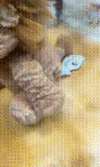

# NNDL-Final

## CIFAR
### Supervise: SimCLR
```python
cd ./CIFAR/SimCLR
python run.py
```
| Method            | Pretrain Dataset | Epoch    | Test Accuracy $\uparrow$ | Improving $\uparrow$ |
|-------------------|------------------|----------|--------------------------|----------------------|
| ResNet18          | -                | 200      | 73.12%                   | -                    |
| ResNet18+SimCLR   | STL10            | 500+200  | 72.62%                   | -0.5%                |
| ResNet18+Pretrain | ImageNet         | 90+200   | **82.30%**               | **9.18%**            |


### CNN and ViT

```
cd ./CIFAR/Supervised/
```
### Train

```
python train.py
```

| Method       | #parameters | Pretrain  | Data Augmentation | Test Accuracy $\uparrow$ |
|--------------|----------------|-----------|-------------------|--------------------------|
| ResNet34     | 21.34M         | $\times$  | Cutmix            | 76.88%                   |
| ResNet34     | 21.34M         | ImageNet  | Cutout            | 83.89%                   |
| ResNet34     | 21.34M         | ImageNet  | Cutmix            | 84.72%                   |
| DeIT-small   | 22.05M         | $\times$  | Cutmix            | 61.41%                   |
| DeIT-small   | 22.05M         | ImageNet  | Cutout            | 85.42%                   |
| DeIT-small   | 22.05M         | ImageNet  | Cutmix            | **87.39%**               |


### Visulization
```
tensorboard --logdir ./logs
```


## NeRF

```
cd NeRF
python run_nerf.py --config configs/lion.txt
```



